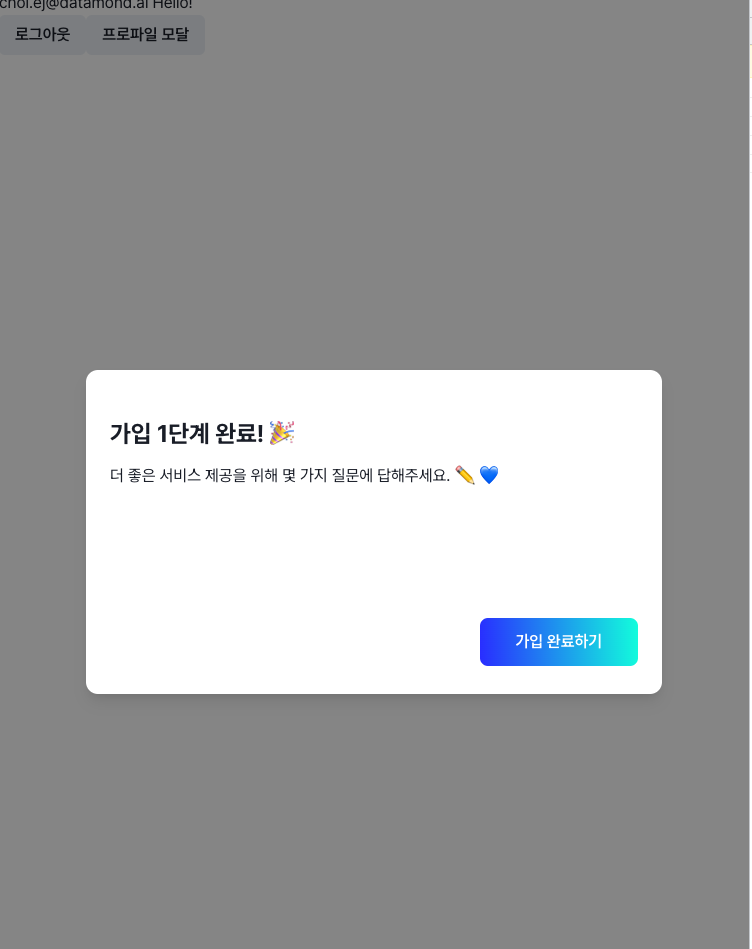
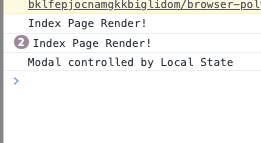
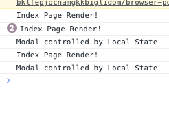
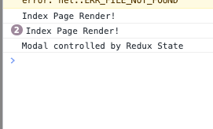
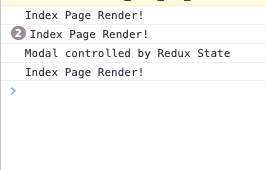
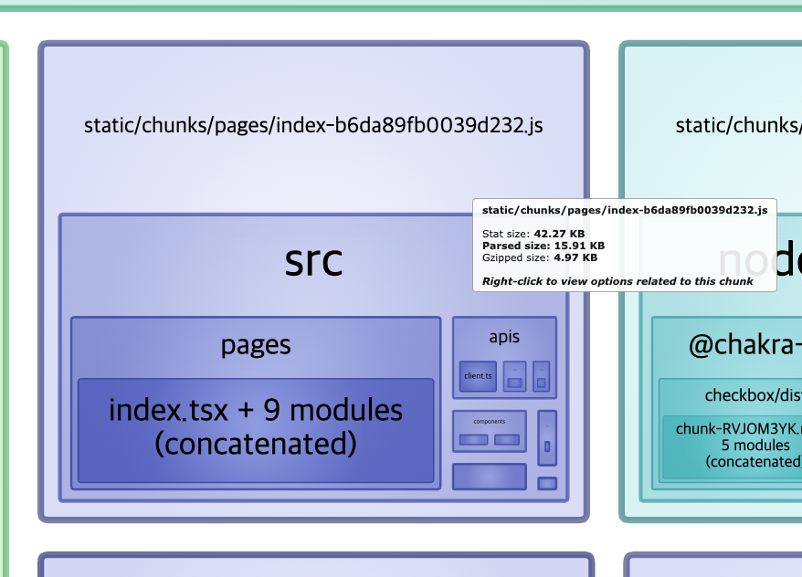
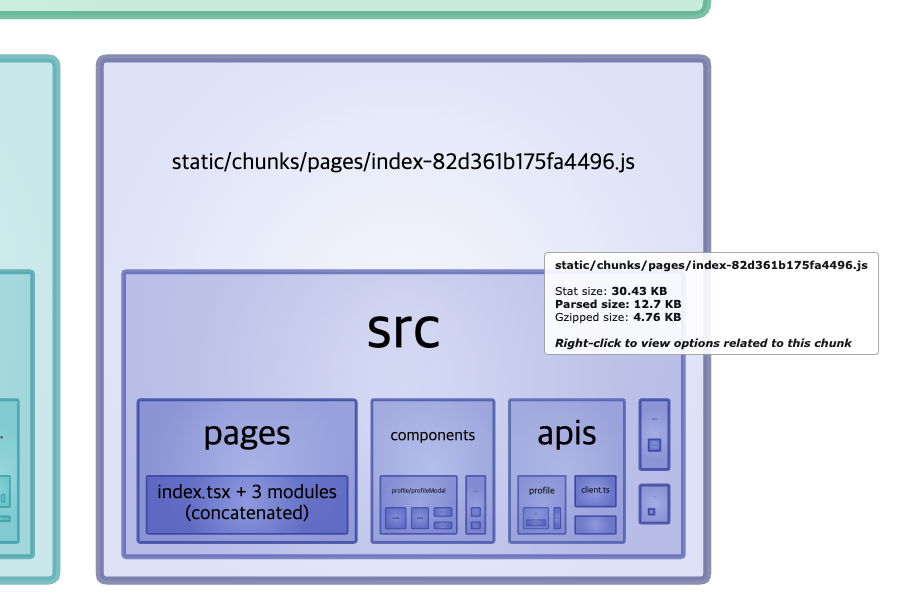

# 모달 성능 최적화 해보기

1. Local state vs Redux state
2. Lazy loading 적용

Ref. [useOverlay](https://slash.page/ko/libraries/react/use-overlay/src/useOverlay.i18n)



## Local state vs Redux state

visible ON/OFF 토글할 때 page 단에서 local 상태를 안 쓸 수 있는 방법 고려

### Local state

```javascript
const IndexPage: NextPageWithLayout = ({}: {}) => {
  const [show, setShow] = useBoolean(false);

  console.log('Index Page Render!');

  return (
    <>
      <Button onClick={setShow.on}>프로파일 모달</Button>
      {show && <TestProfileModal />}
    </>
  );
};

export default IndexPage;
```

버튼 클릭 후 🔽  


window refocus 🔽 (Modal의 콘솔도 계속 찍힘)  


## Redux state

```javascript
const IndexPage: NextPageWithLayout = ({}: {}) => {
  const showProfileModal = useAppSelector(
    (state) => state.ui.showProfileModal,
    shallowEqual
  );
  const getProfileQuery = useGetProfile();

  console.log('Index Page Render!');

  return <>{showProfileModal && <ProfileModal />}</>;
};

export default IndexPage;
```

버튼 클릭 후 🔽  


window refocus 🔽 (Modal의 콘솔은 안 찍힘)  


## Lazy loading 적용

### Before

```javascript
const IndexPage: NextPageWithLayout = ({}: {}) => {
  const showProfileModal = useAppSelector(
    (state) => state.ui.showProfileModal,
    shallowEqual
  );
  const getProfileQuery = useGetProfile();

  console.log('Index Page Render!');

  return <>{showProfileModal && <ProfileModal />}</>;
};

export default IndexPage;
```



### Before

```javascript
const LazyProfileModal = lazy(() =>
  import('../components/profile/profileModal')
);

const IndexPage: NextPageWithLayout = ({}: {}) => {
  const showProfileModal = useAppSelector(
    (state) => state.ui.showProfileModal,
    shallowEqual
  );
  const getProfileQuery = useGetProfile();

  console.log('Index Page Render!');

  return (
    <>
      <Suspense fallback={<></>}>
        {showProfileModal && <LazyProfileModal />}
      </Suspense>
    </>
  );
};

export default IndexPage;
```


