## 웹 성능 최적화 - Part. 1

- Light House를 이용한 페이지 검사
- 이미지 사이즈 최적화
- Bottleneck 코드 최적화
- Bundle 파일 탐색
- Code splitting
- 텍스트 압축

## 적용

### Bundle 파일 탐색 : `@next/bundle-analyzer`

- Before  
  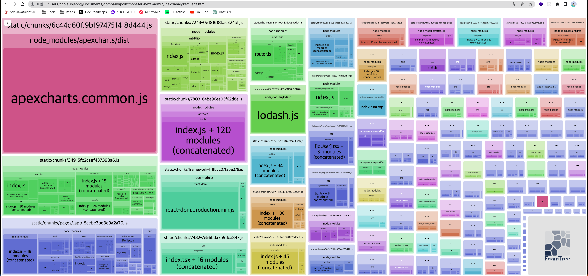
- Vscode
  
- After
  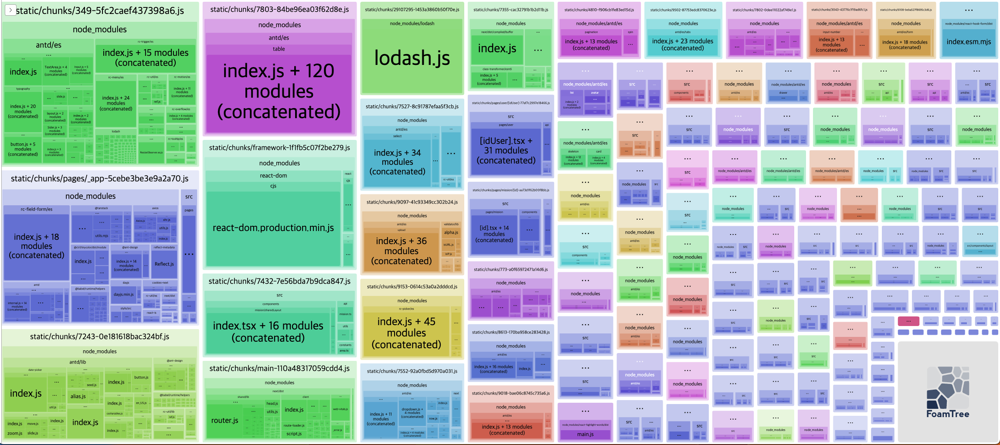

### 폰트

> Ensure text remains visible during webfont load

- Before  
  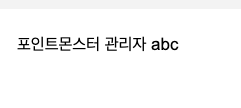  
  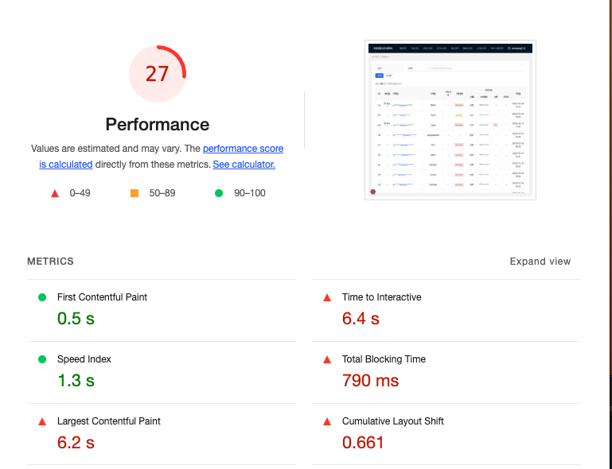</img>
  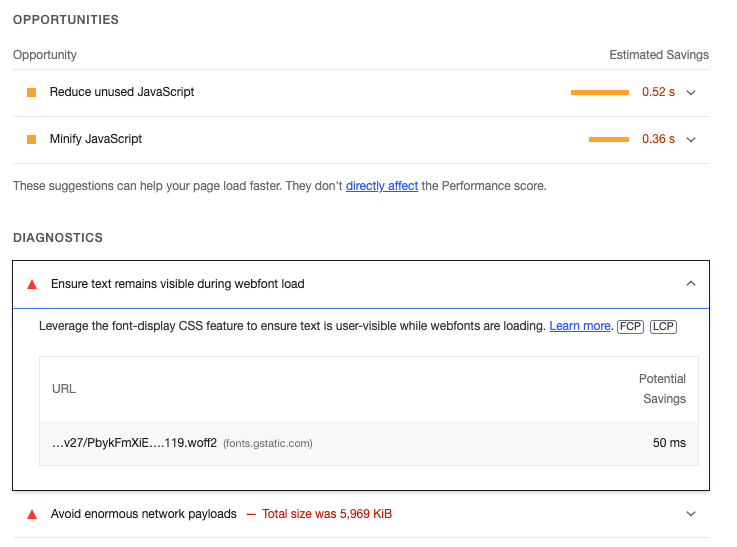
- Vscode
  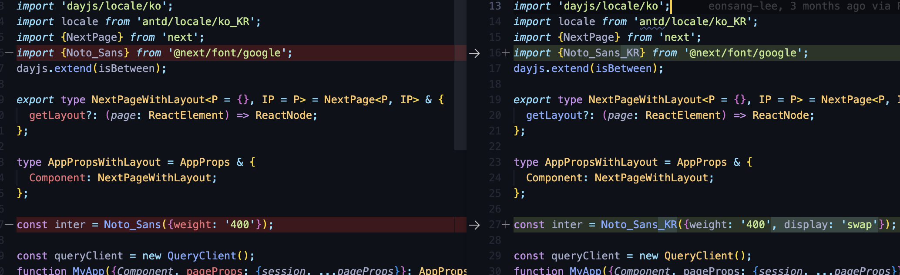
  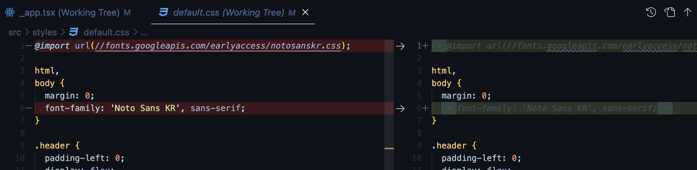
- After  
    
  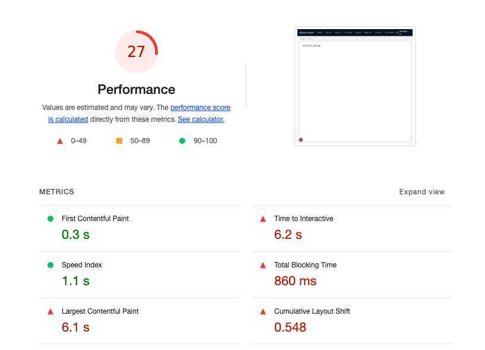</img>
  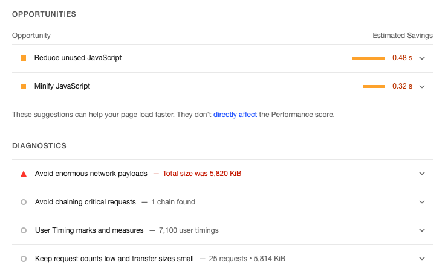

### 이미지 사이즈 최적화

> Properly size images

- Before  
  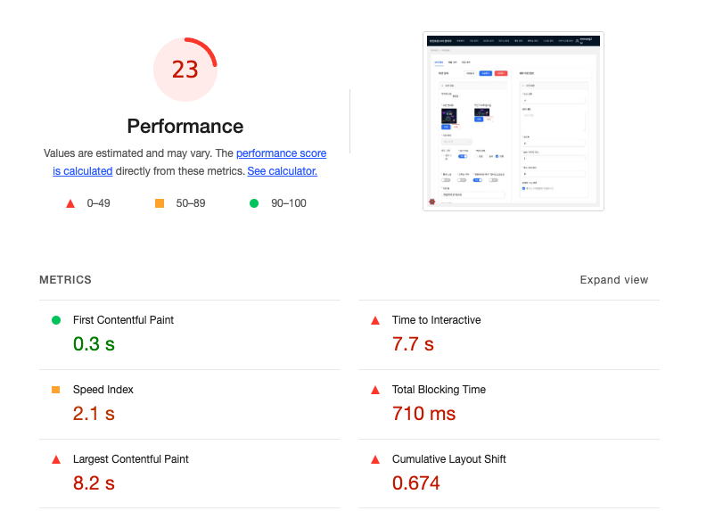</img>
  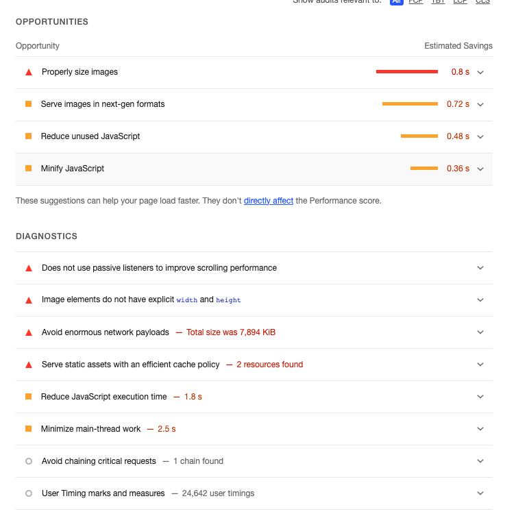
  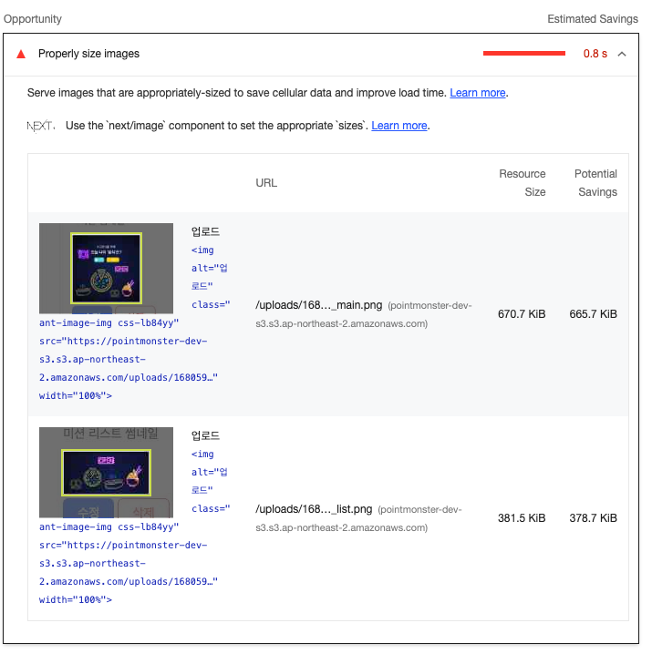
