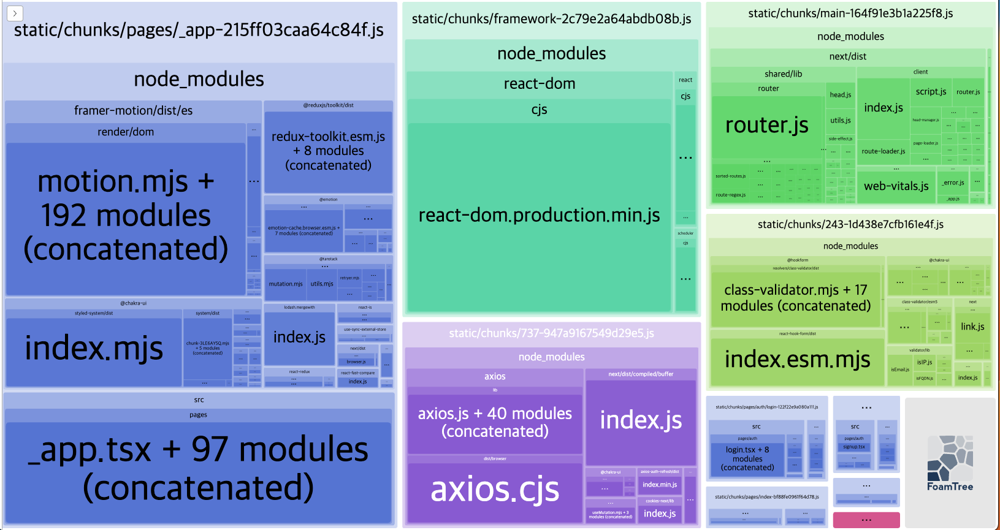
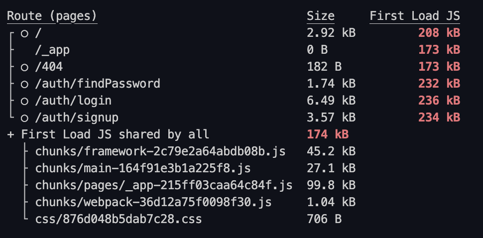
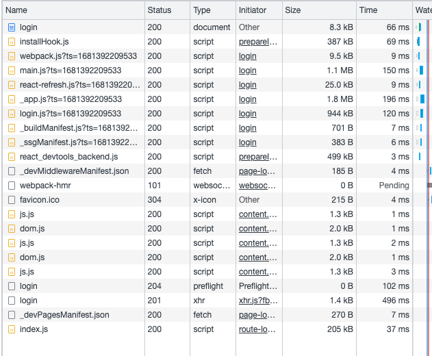
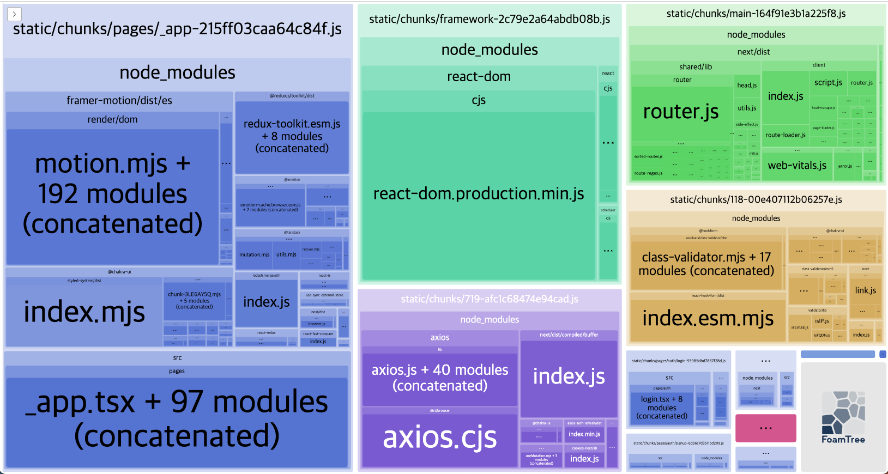
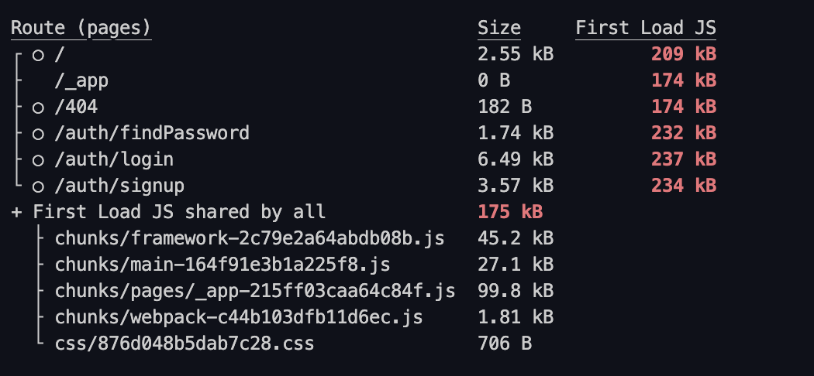
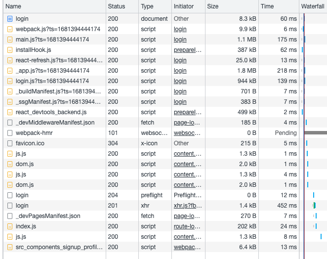

## 웹 성능 최적화 - Part. 2

- 애니메이션 최적화 (Reflow, Repaint)
- 컴포넌트 Lazy Loading (code Splitting)
- 컴포넌트 Preloading
- 이미지 Preloading

## 적용

### 컴포넌트 Lazy Loading (Code Splitting)

- Before  
  
  
  

- Vscode

```javascript
function lazyWithPreload(importFunction: () => Promise<any>) {
  const Component = lazy(importFunction);
  //@ts-ignore
  Component.preload = importFunction;
  return Component;
}

const LazyProfileModal = lazyWithPreload(() =>
  import('../components/signup/profileModal')
);

return (
  /*...*/
  <Button onClick={() => setShowModal.on()}>프로파일 모달</Button>
  <Suspense fallback={null}>{showModal && <LazyProfileModal />}</Suspense>
);
```

- After
  
  
  

\*\*Frame Motion을 쓰는 컴포넌트에 Code Splitting을 해도 번들 분석 결과가 동일했던 이유 :  
Chakra에서 Frame Motion을 자체적으로 쓰기 때문에 Code Splitting으로 `<ProfileModal />`에 lazy loading을 해도 번들 분석 결과가 동일했던 것.
